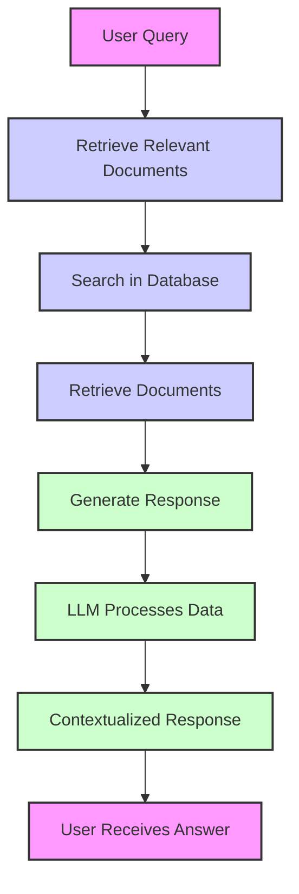

Welcome to the latest installment of our Applied AI Series, where we delve into cutting-edge technologies and explore how they are transforming industries and everyday tasks. In this edition, we’ll unravel the intricacies of RAG (Retrieve and Generate), a powerful framework that’s making waves in the field of artificial intelligence. Whether you're a tech enthusiast, a researcher, or someone curious about AI, this post will provide a clear understanding of RAG and its applications.

<!-- truncate -->

## Understanding RAG

### What Does RAG Stand For?

RAG stands for Retrieve and Generate. It’s an advanced approach in natural language processing (NLP) that combines two fundamental AI techniques:

- Retrieve: This involves searching through a large dataset or document repository to find information that is relevant to a given query or context.
- Generate: After retrieving the relevant information, this component uses AI models to generate a coherent and contextually appropriate response based on the retrieved data.

The synergy between these two components allows RAG systems to provide more accurate, relevant, and contextually rich responses compared to traditional methods that rely solely on retrieval or generation.

### How Does RAG Work?

- Information Retrieval: When a user inputs a query, the RAG system first searches a database or knowledge base to identify relevant documents or pieces of information. This step ensures that the response is grounded in actual data and not just generated from scratch.

- Text Generation: The retrieved information is then fed into a language model, which synthesizes this data to generate a response. This model, often based on advanced architectures like GPT (Generative Pre-trained Transformer), leverages its training to craft responses that are both informative and contextually appropriate.

- Integration: The RAG framework integrates these two processes, ensuring that the generated content is not only relevant but also coherent and engaging.

### Why is RAG Important?

- Enhanced Accuracy: By retrieving specific information from a large dataset, RAG ensures that responses are based on factual data, reducing the likelihood of generating misleading or incorrect answers.

- Contextual Relevance: RAG models excel at understanding the context of a query and providing answers that are not only relevant but also nuanced, addressing the complexities of natural language.

- Scalability: RAG can handle vast amounts of data, making it ideal for applications like building knowledge bases, chatbots, and customer support systems where large-scale information retrieval and generation are crucial.

- Improved UX: By combining retrieval with generation, RAG systems offer more engaging and informative interactions, enhancing user satisfaction and usability.

### Applications of RAG

1. Knowledge Management
   RAG is revolutionizing how organizations manage and access knowledge. By integrating a robust retrieval system with advanced text generation, companies can build comprehensive knowledge bases that are easy to navigate and provide users with precise information.

2. Customer Support
   In customer support, RAG can be used to develop intelligent chatbots and virtual assistants that retrieve relevant information from support documents and generate helpful responses. This improves response accuracy and reduces the time needed to resolve customer queries.

3. Research and Development
   For researchers and developers, RAG can assist in literature reviews and information synthesis by retrieving relevant academic papers and generating summaries or insights, streamlining the research process and saving valuable time.

4. Content Creation
   RAG can also be used in content creation to generate articles, reports, or creative content based on specific topics or data sets, providing a more efficient and contextually rich writing process.

<!-- truncate -->

## Understanding RAG with a Workflow Diagram

:::tip
To help you better understand the role of RAG (Retrieve and Generate) in an AI assistant system, let’s explore a workflow diagram. This diagram will illustrate how RAG integrates with a Large Language Model (LLM) to enhance the AI assistant’s capabilities.
:::

Workflows:

1. User Query: The process begins when a user submits a query to the AI assistant. This could be a question, request for information, or any input requiring a response.

2. Retrieve Relevant Documents: The RAG system initiates the retrieval phase, where it searches through a vast database or knowledge base to find relevant documents or pieces of information related to the user’s query.

3. Search in Database: The retrieval system, often powered by tools like Elasticsearch, performs a search within the database to locate documents that match the query.

4. Retrieve Documents: Relevant documents are retrieved from the database based on the search results. These documents provide the necessary context and information needed for generating a response.

5. Generate Response: The retrieved documents are then fed into the text generation component of the RAG system.

6. LLM Processes Data: A Large Language Model (LLM), such as GPT, processes the retrieved data. The model uses its understanding of language and context to generate a coherent and relevant response.

7. Contextualized Response: The response generated by the LLM is contextualized using the information from the retrieved documents, ensuring that the answer is both accurate and contextually appropriate.

8. User Receives Answer: Finally, the AI assistant delivers the generated response back to the user, providing them with the information or answer they requested.

## References

- https://arxiv.org/abs/2005.11401
- https://aws.amazon.com/what-is/retrieval-augmented-generation/
- https://www.datacamp.com/blog/what-is-retrieval-augmented-generation-rag
- https://learn.microsoft.com/en-us/azure/search/retrieval-augmented-generation-overview
- https://blogs.nvidia.com/blog/what-is-retrieval-augmented-generation/
