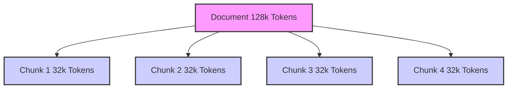
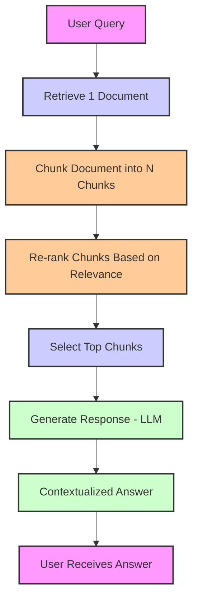

Document chunking is crucial for optimizing Retrieval-Augmented Generation (RAG) systems by breaking large documents into smaller, manageable pieces, which significantly speeds up retrieval and enhances the relevance of results. In RAG, where information retrieval is followed by text generation, chunking allows the system to search and process only the most relevant sections of content, improving both efficiency and accuracy. This approach ensures faster retrieval times, better handling of long-form documents, and more precise generation by focusing on contextually meaningful chunks rather than entire documents, ultimately enhancing the overall performance of LLMs in real-time applications.

<!-- truncate -->

## What is Document Chunking?

Document chunking is the process of breaking down large documents into smaller, semantically meaningful sections or "chunks." These chunks typically range from paragraphs to sentences, allowing the RAG system to process information in smaller units without losing important context. Chunking helps optimize the retrieval phase of RAG by making it easier to index and search smaller parts of documents, rather than dealing with long, monolithic text.

## Why is Document Chunking Important for RAG?

- Faster Retrieval: By chunking documents, the retrieval system only needs to search smaller units of text, drastically reducing the time it takes to find relevant information.

- Improved Contextual Relevance: Smaller chunks allow the system to focus on the most contextually relevant parts of a document, rather than irrelevant or tangential content, leading to more precise and meaningful responses.

- Better Handling of Long-Form Content: Large documents or books are often too unwieldy for efficient processing in a single step. Document chunking allows RAG systems to handle long-form content by breaking it into digestible parts that can be indexed and retrieved effectively.

- Scalability: Chunking makes it easier to scale a RAG system across large datasets, as each chunk can be indexed and queried independently, allowing the system to handle vast amounts of data more efficiently.

## How Document Chunking Works in RAG?

- Input Document: A large document is split into smaller chunks, each containing a distinct section of relevant information (e.g., paragraphs, sections, or sentences).

- Chunk Indexing: Each chunk is indexed for quick retrieval. Modern search engines like Elasticsearch or FAISS can index and search through these smaller units more efficiently than large, full documents.

- Document Retrieval: When a query is made, the system retrieves the most relevant chunks rather than entire documents, significantly improving search speed and accuracy.

- Generation: The retrieved chunks are passed to the generation model, which synthesizes the context from these smaller pieces to produce a coherent response.

<!-- truncate -->

## How Document Chunking Speeds Up LLMs

Document chunking accelerates the entire RAG pipeline in several key ways:

- Parallel Processing: Smaller chunks allow for parallelized retrieval and processing, enabling the system to scale efficiently across multiple documents and queries.
- Reduced Token Count: By breaking down long documents, chunking reduces the number of tokens the LLM has to process at once, making it easier to generate faster responses.
- Improved Search Accuracy: Smaller chunks allow for more focused and precise search results, reducing the time spent sifting through irrelevant data.

## Challenges of Document Chunking

:::tip
As you consider integrating document chunking into your RAG system, think about your specific use case—whether you're building a customer support assistant, a research tool, or a knowledge management system. By experimenting with different chunking strategies, you can fine-tune your RAG pipeline to achieve optimal speed and accuracy.
:::

While document chunking offers significant speedup, there are a few challenges to consider:

- Chunking Granularity: Deciding how small or large each chunk should be is crucial. Too small chunks may lose context, while too large chunks may not offer the desired speed benefits.
- Semantic Integrity: Care must be taken to ensure that chunks retain meaningful and coherent information. Poor chunking can result in fragmented answers or loss of critical context.

<!-- truncate -->

## Popular Document Chunking Strategies in RAG

:::tip
Selecting the right chunking strategy depends on the specific needs of your application, the structure of your documents, and the computational resources available. By tailoring the chunking strategy to the content and task, RAG systems can deliver significantly improved retrieval and generation performance.
:::

### 1. **Fixed-Length Chunking**

- **Overview**: This strategy divides a document into chunks of a pre-determined, fixed size. Typically, chunk sizes are measured by token counts (e.g., 512 tokens per chunk), which makes the process predictable and simple.
- **Pros**:
  - **Simplicity**: Easy to implement, requiring minimal computation to break documents into chunks.
  - **Efficiency**: Useful for fast retrieval when the context size is manageable and doesn't need to be overly granular.
  - **Uniformity**: All chunks are of the same size, which can make processing predictable and manageable.
- **Cons**:
  - **Context Loss**: Important information could be split across chunks, leading to the loss of context.
  - **Inflexibility**: Fixed size might result in chunks that are too short or too long, depending on the document structure.
- **Best For**: Use cases where speed is essential, and documents are relatively short and well-structured. Works best when retrieval tasks don’t require deep, nuanced understanding.

### 2. **Document-Specific Chunking**

- **Overview**: Document-specific chunking is a more flexible approach, where chunks are created based on the document's unique structure. This could involve splitting the document at natural boundaries such as paragraphs, sections, or headings. It ensures that chunks are aligned with the document's inherent organization.
- **Pros**:
  - **Context Preservation**: By chunking at logical document boundaries (such as paragraphs or sections), it preserves contextual integrity within each chunk.
  - **Adaptability**: More adaptable to documents with varying structures, allowing for more meaningful and coherent chunks.
  - **Improved Relevance**: Often results in chunks that are more contextually relevant to user queries, improving retrieval accuracy.
- **Cons**:
  - **Inconsistency**: Chunk sizes may vary depending on the document structure, leading to chunks that may be smaller or larger than optimal.
  - **Complexity**: The need to identify logical document boundaries (e.g., section headings, paragraph markers) adds some complexity compared to fixed-length chunking.
- **Best For**: Longer documents with well-defined structures such as articles, reports, or research papers, where maintaining context within chunks is essential.

### 3. **Semantic Chunking**

- **Overview**: Semantic chunking leverages natural language processing (NLP) models to identify semantically meaningful boundaries within a document. This method groups text segments that share a common theme or topic, ensuring that the chunk reflects a coherent thought or piece of information, regardless of its physical size or paragraph breaks.
- **Pros**:
  - **Context-Aware**: Ensures that chunks are semantically consistent, grouping together related ideas even if they are not in the same paragraph or section.
  - **Improved Retrieval**: By focusing on the meaning and relevance of the content, semantic chunking leads to more accurate document retrieval and higher-quality generated responses.
  - **Flexible Size**: Chunks can be of varying lengths based on the content's meaning rather than arbitrary size constraints.
- **Cons**:
  - **Computationally Intensive**: Requires advanced NLP models (e.g., BERT, GPT) to analyze the content and understand semantic relationships.
  - **Training Data Requirement**: Effective semantic chunking often requires labeled data or a pre-trained model, which may require fine-tuning for optimal performance.
- **Best For**: Complex or long-form documents where semantic meaning is critical for accurately answering queries, such as academic papers, technical documentation, or nuanced content like legal texts.

### How to Choose the Right Chunking Strategy?

- **Fixed-Length Chunking**: Opt for this when the document is simple, short, and when retrieval speed is the main concern. Works well for standardized or structured content.
- **Document-Specific Chunking**: Ideal for documents with clear structural boundaries, such as reports, articles, or documentation where maintaining contextual relevance is important without relying on complex semantic models.
- **Semantic Chunking**: Choose this for complex, unstructured, or long documents where context, topic relevance, and meaning are paramount. Perfect for sophisticated tasks such as question answering, summarization, or complex search.

## Conclusion

Document chunking is a powerful technique that significantly enhances the efficiency of RAG systems, particularly when dealing with large-scale datasets. By breaking down documents into smaller, more manageable chunks, RAG can retrieve and generate more relevant, faster responses, ultimately improving user experience. As the demand for AI systems capable of handling vast amounts of information increases, document chunking will continue to be a vital strategy in optimizing performance.

Each chunking strategy plays a unique role in enhancing the performance of RAG-based systems:

- **Fixed-Length Chunking** is best for speed and simplicity when context is not overly complex.
- **Document-Specific Chunking** provides a balanced approach for documents with natural structures, improving context while keeping chunk size manageable.
- **Semantic Chunking** is the most powerful for ensuring that the chunks are deeply relevant and contextually coherent, especially in complex documents.

## References

- [A Guide to Chunking Strategies for Retrieval Augmented Generation (RAG)](https://aws.amazon.com/what-is/retrieval-augmented-generation/)

- [RAG chunking phase with MS Azure](https://learn.microsoft.com/en-us/azure/architecture/ai-ml/guide/rag/rag-chunking-phase)

- [Document Chunking for AI RAG Applications](https://medium.com/@david.richards.tech/document-chunking-for-rag-ai-applications-04363d48fbf7)

- [Chunking for RAG: best practices](https://unstructured.io/blog/chunking-for-rag-best-practices)
