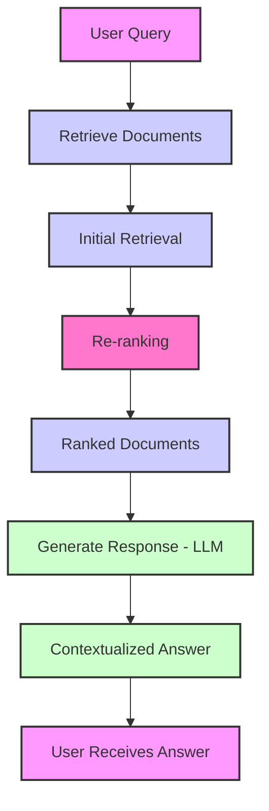

Re-ranking in Retrieval-Augmented Generation (RAG) refines the documents retrieved in response to a user query, ensuring that only the most relevant and contextually appropriate ones are passed to the generation model. This step enhances response accuracy, handles ambiguity, and improves overall result quality by prioritizing the best matches for the query, ultimately leading to more precise and coherent AI-generated answers.

<!-- truncate -->

## What is Re-ranking in RAG?

Re-ranking is the process of refining or reordering the list of documents or data retrieved during the retrieval phase of RAG. After a query is processed and relevant documents are retrieved, re-ranking evaluates these documents to determine which ones are most relevant to the user's question. The documents are then prioritized accordingly before being passed to the generation model for response crafting.

Essentially, re-ranking ensures that the most relevant, contextually appropriate documents are selected, improving the overall accuracy and quality of the generated response.

## Why is Re-ranking Important?

While retrieval systems like Elasticsearch or Dense Retriever can fetch a broad range of documents that are likely to be relevant to a query, not all retrieved documents will necessarily be the most informative or contextually aligned with the user’s intent. Here’s why re-ranking is crucial:

- Improves Response Quality: By selecting the best possible documents, re-ranking helps the AI model generate more accurate and meaningful responses.

- Handles Ambiguity: Queries can sometimes be ambiguous, and not all retrieved documents will be equally relevant. Re-ranking allows the model to prioritize the best matches and address ambiguous or nuanced queries more effectively.

- Contextual Relevance: Even when documents are contextually close, some might provide more precise information based on the specific needs of the query. Re-ranking ensures the AI assistant doesn't rely on documents that are less helpful or only tangentially related.

- Reduces Information Overload: In large-scale information retrieval, you might retrieve dozens or hundreds of documents. Re-ranking streamlines the process by narrowing down the list to only the most relevant ones, making it easier for the LLM to generate an optimal answer.

## How Does Re-ranking Work in a RAG System?

To understand the role of re-ranking in RAG, let's break down the process:

- User Query: The user submits a query to the system.

- Document Retrieval: A search or retrieval system is triggered to find relevant documents from a database or knowledge source. Initially, this could involve a broad set of results that may contain both highly relevant and less useful documents.

- Re-ranking: Before passing the retrieved documents to the LLM for generation, the documents are re-ordered. This step typically involves evaluating factors such as:

  - Semantic Relevance: How closely the content of a document matches the user's query.
  - Contextual Appropriateness: The document's ability to provide useful context for generating an accurate and comprehensive response.
  - Ranking Models: Machine learning models, such as those based on BERT or similar architectures, are often employed to predict the relevance of each document.

- Generation: After re-ranking, the top documents are selected and passed to the LLM, which processes the information and generates a contextualized response.

- Final Response: The user receives a coherent and contextually relevant answer, based on the documents prioritized by the re-ranking phase.

<!-- truncate -->

## Re-ranking strategies

:::tip
To help you better understand the role of RAG (Retrieve and Generate) in an AI assistant system, let choosing the right re-ranker for a RAG (Retrieve and Generate) your system.
:::

### 1. Traditional Retrieval-Based Re-rankers

Traditional retrieval-based re-rankers rely on statistical models to rank the relevance of retrieved documents. These models typically analyze features such as term frequency, document length, and inverse document frequency to score documents. While they are computationally efficient and easy to implement, they often lack the semantic depth and contextual understanding of more advanced models.

#### **Key Techniques:**

- TF-IDF (Term Frequency-Inverse Document Frequency):
  - TF-IDF is one of the oldest and most widely used methods for ranking documents in information retrieval. It scores documents based on how frequently a term appears in the document (Term Frequency) and how rare or common the term is across the entire dataset (Inverse Document Frequency).
  - Pros: Simple and computationally inexpensive, widely understood.
  - Cons: Does not capture semantic relationships or context; struggles with synonyms and polysemy (words with multiple meanings).
- BM25 (Best Matching 25):
  - BM25 is an advanced probabilistic retrieval model that builds on TF-IDF. It scores documents based on term frequency and document length but introduces parameters like a "saturation" factor, which adjusts the impact of term frequency at higher values. BM25 is more flexible and often more effective than pure TF-IDF.
  - Pros: Robust performance in many standard retrieval tasks; works well for general-purpose search engines.
  - Cons: Like TF-IDF, it doesn’t account for deeper semantic meaning or context.

#### **When to Use:**

Traditional re-ranking techniques like TF-IDF and BM25 are useful in situations where speed and simplicity are paramount, and when the data does not require deep semantic analysis. These methods are typically a starting point before transitioning to more complex neural-based re-ranking approaches.

### 2. Neural-based Re-rankers

Neural-based re-ranking models leverage deep learning techniques to rank documents based on their semantic relevance to a given query. These models go beyond surface-level keyword matching and instead consider the meanings, relationships, and context of both the query and the retrieved documents.

#### **Key Techniques:**

- Transformer-based Models (e.g., BERT, RoBERTa, ALBERT):

  - Transformer-based models are pre-trained on vast amounts of text and can understand contextual relationships between words, sentences, and even entire paragraphs. Fine-tuning these models on a ranking dataset can produce highly accurate re-ranking systems that understand both the query and the retrieved document at a deeper level.
  - Pros: Great at handling context, synonyms, and ambiguous queries; captures semantic meaning effectively.
  - Cons: Requires significant computational resources for training and fine-tuning; can be slower than traditional models.

- BERT-based Re-rankers (Cross-Encoder):

  - In a typical BERT-based re-ranker, the query and document are passed together as a pair to the model, which generates a relevance score based on both the query and the document's content. The output is a binary classification or relevance score.
  - Pros: Very effective in understanding the fine-grained relevance between a query and document.
  - Cons: Computationally expensive due to the pairwise processing (query + document), making it slower than traditional models.

- DPR (Dense Passage Retrieval):

  - DPR is an end-to-end learning framework that uses two separate neural networks: one for encoding the query and another for encoding documents (passages). These networks are trained jointly so that the query embedding and the document embedding are close in vector space for relevant document-query pairs.
  - Pros: Extremely good at semantic matching between queries and documents; can outperform traditional methods in complex search tasks.
  - Cons: Like BERT, it can be resource-intensive, especially for large-scale datasets.

#### **When to Use:**

Neural-based re-rankers are ideal for more complex, context-rich queries, particularly where the interaction between the query and documents is nuanced. These models are highly beneficial when semantic understanding and contextual relevance are important, but the computational cost is higher.

### 3. Learning-to-Rank (LTR) Models

Learning-to-Rank is a machine learning approach where models are trained specifically to rank documents according to a given query. LTR models use labeled training data to learn which features (such as term relevance, document quality, semantic similarity, etc.) contribute most to the relevance of a document to a specific query.

#### **Key Techniques:**

- Gradient Boosted Decision Trees (GBDT):

  - GBDT algorithms, like XGBoost or LightGBM, are commonly used in LTR models for re-ranking. These algorithms build an ensemble of decision trees, with each tree focusing on correcting the errors made by the previous one. GBDT models are effective at handling multiple features for ranking and can be highly optimized.
  - Pros: Can handle a variety of features (e.g., term frequency, document quality, contextual features) and are highly interpretable.
  - Cons: Requires careful feature engineering; not as effective as deep learning models in capturing semantic context.

- Neural Learning-to-Rank (NLR):

  - NLR approaches use deep neural networks to learn the ranking function directly from raw text. This approach can take into account a wider array of features beyond what is available to traditional models (e.g., word embeddings, attention scores, etc.).
  - Pros: Can potentially learn more complex relationships between query and document relevance.
  - Cons: Requires a large amount of labeled training data and significant computational resources.

- RankNet, LambdaMART, and ListNet:

  - These are popular algorithms used in Learning-to-Rank systems, often based on pairwise or listwise ranking principles. RankNet, for instance, is a neural network model that learns to rank document pairs, whereas LambdaMART is an extension of MART (Multiple Additive Regression Trees) optimized for ranking tasks.
  - Pros: High performance when there is enough labeled data for training; good at combining multiple features.
  - Cons: Requires a large dataset for training, and fine-tuning can be complex.

#### **When to Use:**

Learning-to-Rank models are best for scenarios where you have labeled training data and want to tailor the re-ranking to a specific set of features that influence relevance. This approach is commonly used in search engines and personalized information retrieval systems.

### 4. Hybrid Re-ranking Models

Hybrid models combine the strengths of traditional information retrieval techniques and neural-based models to achieve optimal performance. These systems often use a multi-step process, where an initial retrieval phase is followed by a neural re-ranking phase that refines the results.

#### **Key Techniques:**

- Combining BM25 with BERT or RoBERTa:

  - One common hybrid approach is to first retrieve a set of documents using traditional methods like BM25 or TF-IDF, and then pass these documents through a BERT-based re-ranker for semantic relevance evaluation. This hybrid model balances speed (BM25) with deep understanding (BERT).
  - Pros: Combines the efficiency of traditional methods with the power of modern NLP models, offering a balance of speed and accuracy.
  - Cons: Still requires careful design and resource management, especially when handling large-scale datasets.

- Feature Fusion (Traditional + Neural Features):

  - In this approach, traditional features (like keyword overlap) are combined with neural network features (like contextual embeddings). These features are then input into a machine learning model (such as GBDT or a neural network) that ranks documents.
  - Pros: Enables the model to leverage the best of both worlds—semantic understanding and feature-rich analysis.
  - Cons: Feature engineering and model training can be complex and time-consuming.

#### **When to Use:**

Hybrid re-ranking models are ideal when you want to take advantage of both traditional efficiency and advanced semantic understanding. These models work well when you're balancing real-time performance with high-quality, nuanced ranking.

## Conclusion

Re-ranking is a critical component of the RAG framework, acting as a fine-tuner for the retrieval process. By ensuring that only the most relevant, contextually accurate documents are passed to the generation model, re-ranking directly enhances the quality and precision of the AI assistant’s responses.

Choosing the right re-ranker for a RAG system depends on your application's specific requirements, including:

- Speed: Traditional methods like BM25 are fast and simple.
- Accuracy: Neural re-rankers (like BERT) offer deep semantic understanding but come with a higher computational cost.
- Customization: Learning-to-Rank models can be tailored to specific features of the dataset and query patterns.
- Hybrid Approaches: Hybrid re-rankers combine traditional and neural methods to balance efficiency and accuracy.

By carefully considering these factors, you can select the most effective re-ranking strategy to optimize your RAG system and enhance the overall user experience.

**By carefully considering these factors, you can select the most effective re-ranking strategy to optimize your RAG system and enhance the overall user experience.**

## References

- [Retrieval-Augmented Generation (RAG) - A Survey](https://arxiv.org/abs/2005.11401)
- [What is Retrieval-Augmented Generation (RAG)?](https://aws.amazon.com/what-is/retrieval-augmented-generation/)
- [RAG: A New Era of Language Model Integration](https://blogs.nvidia.com/blog/what-is-retrieval-augmented-generation/)
- [Microsoft Azure: Overview of Retrieval-Augmented Generation](https://learn.microsoft.com/en-us/azure/search/retrieval-augmented-generation-overview)
- [Dense Passage Retrieval for Open-Domain Question Answering](https://arxiv.org/abs/2004.04906)
- [Learning to Rank with Neural Networks: RankNet](https://www.microsoft.com/en-us/research/wp-content/uploads/2007/01/RankNet-Technical-Report.pdf)
- [BERT for Re-ranking: Understanding How Transformers Work in Information Retrieval](https://towardsdatascience.com/using-bert-for-re-ranking-information-retrieval-cf097d9a5899)
- [BM25: Probabilistic Ranking Function](https://en.wikipedia.org/wiki/BM25)
- [XGBoost: A Comprehensive Guide](https://xgboost.readthedocs.io/en/latest/)
- [Introduction to Learning-to-Rank Algorithms](https://www.datacamp.com/community/blog/learning-to-rank)
